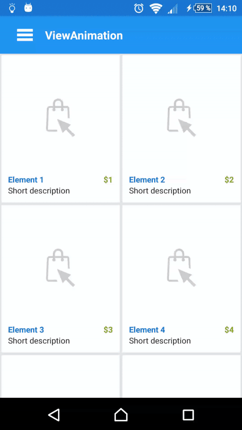

# View Animation

Example of View Animations with ObjectAnimator.

## About

Example using a `translate`, `scale` and `rotation3d` with `depth` animations. The animation has a listener for when finishes.
After animation is applied, the view is fully functional.

Press the toolbar icon to see the animation.

## Configuration

```java
animationManager = new AnimationManager(mainContent, mainMenu, MetricsUtils.get().getMetrics());
animationManager.setPositionPercentageX(0.5f)
                .setPositionPercentageY(0)
                .withScaleCorrection(true)
                .setScaleFactor(0.8f)
                .setRotationX(0)
                .setRotationY(-10)
                .setRotationZ(0)
                .setDepth(0)
                .setMenuDelay(250);
```

## Usage

- Without feedback

    ```java
    animationManager.animate();
    ```

- With feedback

    ```java
    animationManager.animate(() -> Log.i(Constants.TAG, "Animation finished"));
    ```

- If you need to know if the views are already animated

    ```java
    if (animationManager.isAnimated()) {

    }
    ```
    
- If you need to force the animation, for instance if you are using `onRestoreInstanceState()`
  
    ```java
    animationManager.setAnimated(animated);
    ```

## Screenshots



## License
    Copyright 2016 Esteban Latre
    
    Licensed under the Apache License, Version 2.0 (the "License");
    you may not use this file except in compliance with the License.
    You may obtain a copy of the License at
    
        http://www.apache.org/licenses/LICENSE-2.0
    
    Unless required by applicable law or agreed to in writing, software
    distributed under the License is distributed on an "AS IS" BASIS,
    WITHOUT WARRANTIES OR CONDITIONS OF ANY KIND, either express or implied.
    See the License for the specific language governing permissions and
    limitations under the License.
